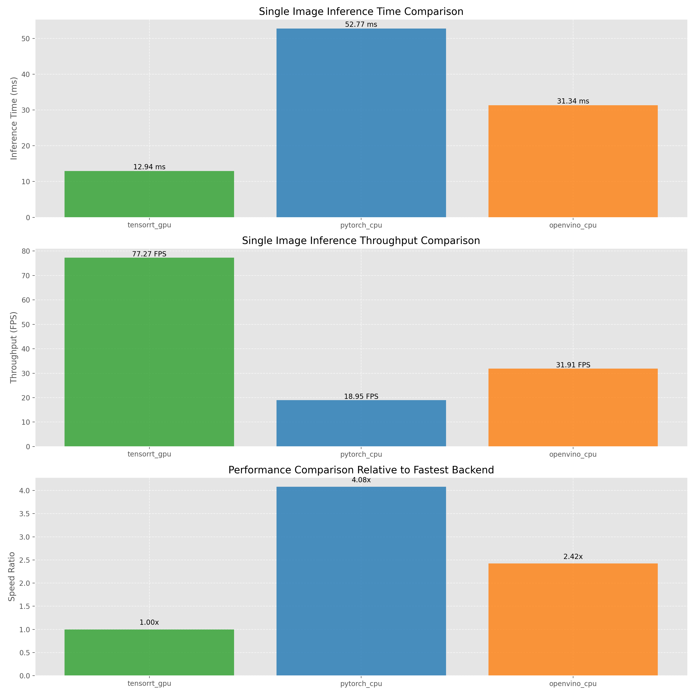
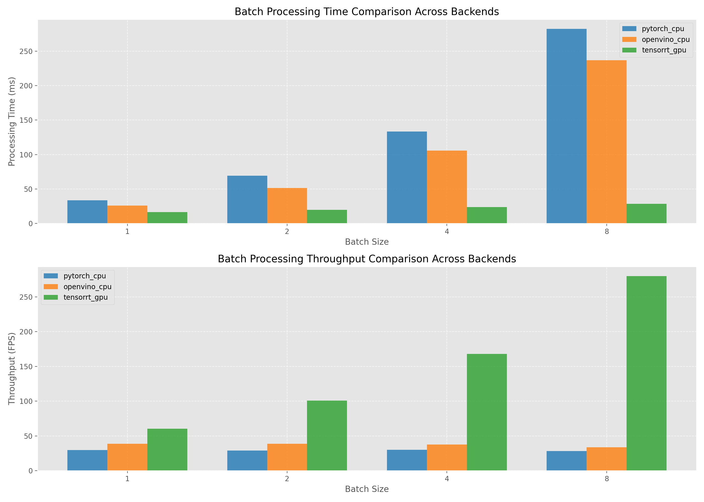
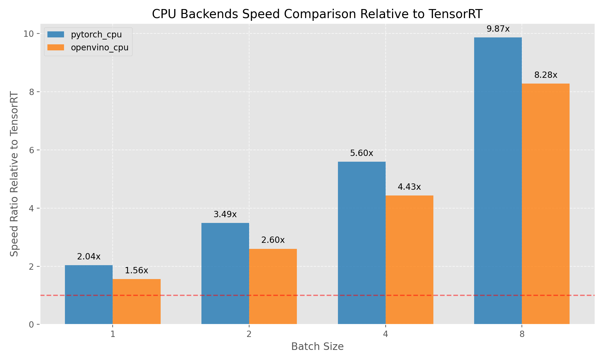

# YOLOv8 Object Detection with Multiple Backends

This project demonstrates how to use YOLOv8 for object detection with multiple inference backends. It supports PyTorch (CPU), OpenVINO (CPU), and TensorRT (GPU) for inference, allowing you to compare performance across different platforms.

## Performance Comparison

Test Environment:
- NVIDIA GeForce RTX 4070 Ti SUPER
- 11th Gen Intel Core i7-11700
- 32GB RAM
- Windows 11 + WSL2 Ubuntu 22.04
- CUDA 11.7
- TensorRT 10.9.0.34
- OpenVINO 2023.3.0

### Single Image Inference Performance



Average values across all test images:

| Inference Backend | Average Inference Time (ms) | FPS |
|---------|--------------|-----|
| TensorRT GPU | 13.36 | 74.85 |
| OpenVINO CPU | 33.78 | 29.60 |
| PyTorch CPU | 54.87 | 18.23 |

### Batch Processing Performance



Performance metrics with different batch sizes:

| Batch Size | TensorRT (ms/FPS) | OpenVINO (ms/FPS) | PyTorch (ms/FPS) |
|-----------|-------------------|-------------------|------------------|
| 1 | 16.55 / 60.42 | 33.15 / 30.17 | 51.93 / 19.26 |
| 2 | 19.86 / 100.70 | 42.52 / 47.04 | 92.81 / 21.55 |
| 4 | 23.83 / 167.83 | 60.29 / 66.35 | 166.71 / 24.00 |
| 8 | 28.60 / 279.72 | 107.89 / 74.15 | 326.56 / 24.50 |

### CPU Backends Speed Comparison Relative to TensorRT



*Note: Higher ratio values indicate how many times slower the CPU backend is compared to TensorRT.*

Key observations:
1. TensorRT provides the best performance across all batch sizes and single-image inference
2. TensorRT's throughput gain is most significant as batch size increases
3. OpenVINO performs better than PyTorch on CPU, especially with larger batch sizes
4. For single image inference, TensorRT is approximately 2.5x faster than OpenVINO and 4.1x faster than PyTorch
5. At batch size 8, OpenVINO's throughput is approximately 3x higher than PyTorch

## Features

- Support for multiple inference backends (PyTorch CPU, OpenVINO CPU, TensorRT GPU)
- Automatic model conversion between formats
- Comprehensive performance benchmarking
- Batch processing of random or all images in a directory
- Performance comparison visualization
- Detection results saved with bounding boxes and labels

## Quick Start

### Installation

```bash
# Install dependencies
pip install -r requirements.txt

# For conda environment
conda activate py38
pip install -r requirements.txt
```

### Running the Demo

```bash
# Run benchmark comparison across all available backends
python src/simple_demo.py --compare_all --save_summary

# Test random images with all available backends
python src/simple_demo.py --mode all --num_images 3 --results_dir test_results

# Test all images with all available backends
python src/simple_demo.py --test_all --mode all --results_dir test_results_all

# Run specific backend (pytorch_cpu, openvino_cpu, or tensorrt_gpu)
python src/simple_demo.py --mode pytorch_cpu --image test_images/800px-Cat03.jpg
```

### Command Options

```
--image           : Input image path (default: test_images/800px-Cat03.jpg)
--model           : Model path (default: yolov8n.pt)
--threshold       : Detection confidence threshold (default: 0.25)
--output          : Output directory for saving results (default: output)
--mode            : Run mode: pytorch_cpu, openvino_cpu, tensorrt_gpu, or all
--benchmark       : Run multiple inferences to benchmark performance
--benchmark_runs  : Number of inference runs for benchmarking (default: 10)
--compare_all     : Compare all available backends
--save_summary    : Save summary to a text file
--num_images      : Number of random images to test (default: 5)
--test_all        : Test all images in test_images directory
--results_dir     : Directory for detection results (default: test_results)
--benchmark_dir   : Directory for benchmark results (default: benchmark_results)
```

## Project Structure

```
yolo-openvino-demo/
├── benchmark_results/     # Benchmark results and charts
├── models/                # Model storage directory
│   └── yolov8n_openvino_model/  # OpenVINO IR model
├── src/                   # Source code
│   ├── download_model.py  # Model download script
│   └── simple_demo.py     # Main demo script with all functionality
├── test_images/           # Test images
├── test_results/          # Detection results by backend
│   ├── pytorch_cpu/       # PyTorch CPU detection results
│   ├── openvino_cpu/      # OpenVINO CPU detection results
│   └── tensorrt_gpu/      # TensorRT GPU detection results
├── install.sh             # Installation script
└── requirements.txt       # Dependency list
```

## Troubleshooting

If you encounter issues:

1. Ensure all dependencies are installed (`pip install -r requirements.txt`)
2. For TensorRT issues:
   - Check that CUDA and TensorRT are properly installed
   - If TensorRT model conversion fails, try using the `--skip_convert` option
3. For OpenVINO issues:
   - Ensure OpenVINO is correctly installed and configured
   - Try setting environment variable `export OPENVINO_FORCE_CPU=1`
4. For PyTorch issues:
   - Check PyTorch installation with correct CUDA version

## Performance Tips

For best performance:

1. **TensorRT on GPU** provides the fastest inference times (~13.5ms / 74 FPS) for single image processing
2. **TensorRT with batch processing** offers dramatically higher throughput for multiple images on GPU
3. **OpenVINO on CPU** offers the best performance for batch processing on CPU
4. When GPU is not available, **OpenVINO on CPU** offers significantly better performance than PyTorch CPU
5. Batch sizes between 4-8 provide optimal throughput for CPU processing
6. Image size significantly affects inference time; consider resizing for performance-critical applications