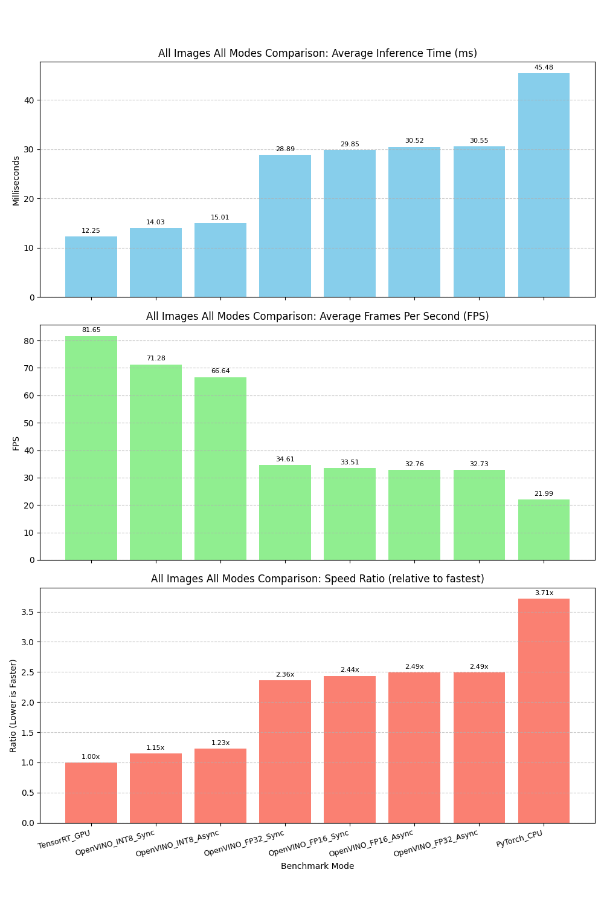
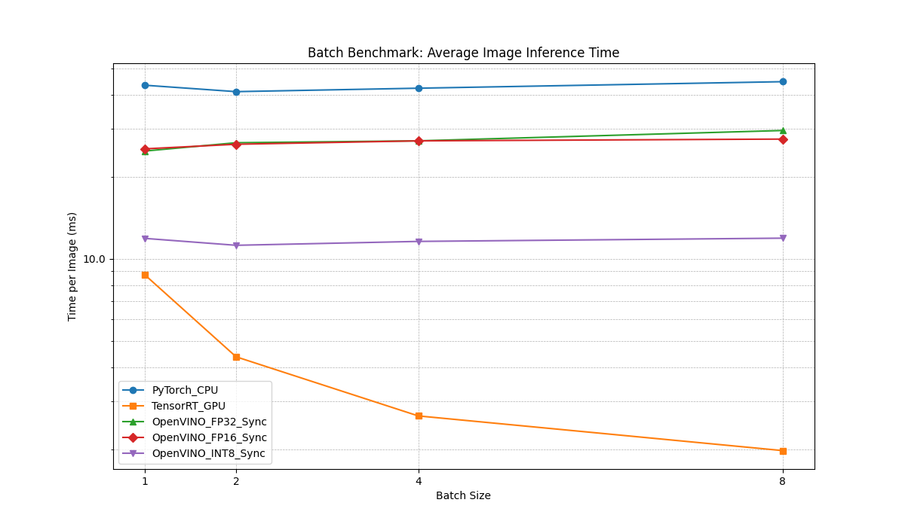
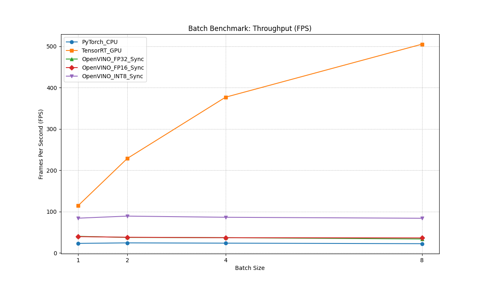

# YOLOv8 Object Detection with Multiple Backends

This project demonstrates how to use YOLOv8 for object detection with multiple inference backends. It supports PyTorch (CPU), OpenVINO (CPU), and TensorRT (GPU) for inference, allowing you to compare performance across different platforms.

## Performance Comparison

Test Environment:
- NVIDIA GeForce RTX 4070 Ti SUPER
- 12th Gen Intel(R) Core(TM) i7-12700KF
- 64GB RAM
- Windows 11 + WSL2 Ubuntu 22.04
- CUDA 11.7
- TensorRT 10.9.0.34
- OpenVINO 2023.3.0

## Quick Start

### Installation

```bash
# Install dependencies
pip install -r requirements.txt

# For conda environment
conda activate py38
pip install -r requirements.txt
```

### Running the Demo

```bash
# Run benchmark comparison across all available backends
python src/simple_demo.py --compare_all --save_summary

# Test random images with all available backends
python src/simple_demo.py --mode all --num_images 3 --results_dir test_results

# Test all images with all available backends
python src/simple_demo.py --test_all --mode all --results_dir test_results_all

# Run specific backend (pytorch_cpu, openvino_cpu, or tensorrt_gpu)
python src/simple_demo.py --mode pytorch_cpu --image test_images/800px-Cat03.jpg
```

### All Images All Modes Comparison

*Average performance across all 14 images in `test_images` directory.*
*(Run Date: approx. 2025-04-02 20:41)*



| Mode                | Avg Time (ms) | Avg FPS   | Speed Ratio (vs Fastest) | Processed |
|-------------------|---------------|-----------|--------------------------|-----------|
| **TensorRT GPU**        |     **12.25**     | **81.65** |        **1.00x**         | 14/14     |
| OpenVINO INT8 Sync  |     14.03     |   71.28   |         1.15x          | 14/14     |
| OpenVINO INT8 Async |     15.01     |   66.64   |         1.23x          | 14/14     |
| OpenVINO FP32 Sync  |     28.89     |   34.61   |         2.36x          | 14/14     |
| OpenVINO FP16 Sync  |     29.85     |   33.51   |         2.44x          | 14/14     |
| OpenVINO FP16 Async |     30.52     |   32.76   |         2.49x          | 14/14     |
| OpenVINO FP32 Async |     30.55     |   32.73   |         2.49x          | 14/14     |
| PyTorch CPU         |     45.48     |   21.99   |         3.71x          | 14/14     |

*(Note: Fastest mode determined by minimum average time across all tested images.)*

Key observations from all images test:
1.  **TensorRT GPU** consistently provides the best average performance.
2.  **OpenVINO INT8 (Sync/Async)** is significantly faster than FP32/FP16 on CPU, offering the second-best performance tier.
3.  **OpenVINO FP32/FP16** modes show similar performance, with FP32 Sync being slightly faster than FP16 Sync in this average test. Asynchronous execution for FP32/FP16 offers minimal benefit on average across these images.
4.  **PyTorch CPU** remains the slowest option.

### Batch Processing Performance (All Modes)

*Benchmark using a single repeated image (`test_images/800px-Cat03.jpg`) across different batch sizes.*
*(Run Date: approx. 2025-04-02 22:21)*

**Performance Plots:**




**Detailed Metrics:**

**Average Batch Time (ms/batch):**
| Mode               | BS=1    | BS=2    | BS=4    | BS=8    |
|--------------------|---------|---------|---------|---------|
| PyTorch CPU        | 43.40   | 87.09   | 177.05  | 357.74  |
| TensorRT GPU       | 8.73    | 9.89    | 11.30   | 15.82   |
| OpenVINO FP32 Sync | 24.89   | 51.18   | 103.09  | 236.89  |
| OpenVINO FP16 Sync | 25.35   | 51.94   | 104.74  | 220.22  |
| OpenVINO INT8 Sync | 11.89   | 22.47   | 46.39   | 95.34   |

**Average Image Time (ms/image):**
| Mode               | BS=1    | BS=2    | BS=4    | BS=8    |
|--------------------|---------|---------|---------|---------|
| PyTorch CPU        | 43.40   | 43.54   | 44.26   | 44.72   |
| TensorRT GPU       | 8.73    | 4.94    | 2.83    | 1.98    |
| OpenVINO FP32 Sync | 24.89   | 25.59   | 25.77   | 29.61   |
| OpenVINO FP16 Sync | 25.35   | 25.97   | 26.19   | 27.53   |
| OpenVINO INT8 Sync | 11.89   | 11.23   | 11.60   | 11.92   |

**Throughput (FPS):**
| Mode               | BS=1    | BS=2    | BS=4    | BS=8    |
|--------------------|---------|---------|---------|---------|
| PyTorch CPU        | 23.04   | 22.96   | 22.59   | 22.36   |
| TensorRT GPU       | 114.52  | 202.25  | 353.88  | 505.57  |
| OpenVINO FP32 Sync | 40.18   | 39.07   | 38.80   | 33.77   |
| OpenVINO FP16 Sync | 39.45   | 38.51   | 38.19   | 36.33   |
| OpenVINO INT8 Sync | 84.11   | 89.00   | 86.23   | 83.91   |

Key observations from batch benchmark:
1.  **TensorRT GPU** shows massive throughput scaling with batch size, significantly reducing the time per image.
2.  **OpenVINO INT8 Sync** provides the best CPU performance and maintains relatively stable time per image, indicating good CPU utilization but potentially hitting a bottleneck preventing further scaling seen on GPU.
3.  **OpenVINO FP32/FP16 Sync** on CPU show limited scaling benefits from batching in this test; throughput remains relatively flat or slightly decreases.
4.  **PyTorch CPU** shows minimal change with batch size, confirming its lower efficiency for parallel processing compared to optimized backends.


## Features

- Support for multiple inference backends (PyTorch CPU, OpenVINO CPU, TensorRT GPU)
- Automatic model conversion between formats
- Comprehensive performance benchmarking
- Batch processing of random or all images in a directory
- Performance comparison visualization
- Detection results saved with bounding boxes and labels


### Command Options

```
--image           : Input image path (default: test_images/800px-Cat03.jpg)
--model           : Model path (default: yolov8n.pt)
--threshold       : Detection confidence threshold (default: 0.25)
--output          : Output directory for saving results (default: output)
--mode            : Run mode: pytorch_cpu, openvino_cpu, tensorrt_gpu, or all
--benchmark       : Run multiple inferences to benchmark performance
--benchmark_runs  : Number of inference runs for benchmarking (default: 10)
--compare_all     : Compare all available backends
--save_summary    : Save summary to a text file
--num_images      : Number of random images to test (default: 5)
--test_all        : Test all images in test_images directory
--results_dir     : Directory for detection results (default: test_results)
--benchmark_dir   : Directory for benchmark results (default: benchmark_results)
```

## Project Structure

```
yolo-openvino-demo/
├── benchmark_results/     # Benchmark results and charts
├── models/                # Model storage directory
│   └── yolov8n_openvino_model/  # OpenVINO IR model
├── src/                   # Source code
│   ├── download_model.py  # Model download script
│   └── simple_demo.py     # Main demo script with all functionality
├── test_images/           # Test images
├── test_results/          # Detection results by backend
│   ├── pytorch_cpu/       # PyTorch CPU detection results
│   ├── openvino_cpu/      # OpenVINO CPU detection results
│   └── tensorrt_gpu/      # TensorRT GPU detection results
├── install.sh             # Installation script
└── requirements.txt       # Dependency list
```

## Troubleshooting

If you encounter issues:

1. Ensure all dependencies are installed (`pip install -r requirements.txt`)
2. For TensorRT issues:
   - Check that CUDA and TensorRT are properly installed
   - If TensorRT model conversion fails, try using the `--skip_convert` option
3. For OpenVINO issues:
   - Ensure OpenVINO is correctly installed and configured
   - Try setting environment variable `export OPENVINO_FORCE_CPU=1`
4. For PyTorch issues:
   - Check PyTorch installation with correct CUDA version

### OpenVINO INT8 Quantization Notes & Tips

Quantizing models to INT8 with OpenVINO can significantly boost CPU performance but might require extra steps and troubleshooting:

1.  **Quantization is Offline**: INT8 inference requires a model pre-quantized using tools like OpenVINO POT or NNCF. It's not an on-the-fly conversion during inference.
2.  **POT Tool (Deprecated)**:
    *   The Post-Training Optimization Tool (POT) is officially deprecated, and NNCF is recommended.
    *   If using POT:
        *   Requires `openvino-dev` installation (`pip install openvino-dev`).
        *   The `pot` command might not be in PATH. Find its full path (e.g., `~/miniconda3/envs/YOUR_ENV/bin/pot`) and use that.
        *   Ensure the FP32 OpenVINO model (`.xml`/`.bin`) exists *before* running POT and the path in the POT config (`.yml`) is correct.
        *   May encounter errors with telemetry, parameters (`--output-dir` vs `-o`), or specific model operations (like `Concat` shape inference). Re-exporting the FP32 model or trying different POT presets (`mixed` vs `performance`) might help, but switching to NNCF is often more reliable.
3.  **NNCF (Recommended)**:
    *   Install via `pip install nncf`. It also requires `torch` and `torchvision`.
    *   Requires a Python script (like `quantize_nncf.py` in this project) to perform quantization, not just a config file.
    *   Needs a representative **calibration dataset** (images from `test_images` can work).
    *   NNCF API might change between versions. We encountered:
        *   `AttributeError: module 'nncf' has no attribute 'Preset'`: Solution was to remove the `preset` argument from `nncf.quantize()` and use defaults.
        *   `TypeError: object of type 'Dataset' has no len()`: Solution was to calculate the number of calibration samples *before* creating the `nncf.Dataset` object and pass that count to `subset_size`.
4.  **Asynchronous Callback Signature**: OpenVINO's `AsyncInferQueue.set_callback()` API might expect different arguments depending on the version. We encountered errors because the callback was passed extra arguments. Solution was to define the callback to accept extra arguments using `*args`: `def callback_func(request, *args): ...`.
5.  **Model Loading Logic**: Ensure your inference script correctly checks for the `precision == 'INT8'` flag and uses the `--int8_model_dir` argument to load the *actual* INT8 model `.xml` file, not fall back to the FP32 version.
6.  **Accurate Benchmarking**: Use `time.perf_counter()` instead of `time.time()` for measuring inference time to avoid potential issues with clock resolution or system time adjustments, which can lead to inaccurate or even negative timings.

## Performance Tips

For best performance:

1. **TensorRT on GPU** provides the fastest inference times (~13.5ms / 74 FPS) for single image processing
2. **TensorRT with batch processing** offers dramatically higher throughput for multiple images on GPU
3. **OpenVINO on CPU** offers the best performance for batch processing on CPU
4. When GPU is not available, **OpenVINO on CPU** offers significantly better performance than PyTorch CPU
5. Batch sizes between 4-8 provide optimal throughput for CPU processing
6. Image size significantly affects inference time; consider resizing for performance-critical applications