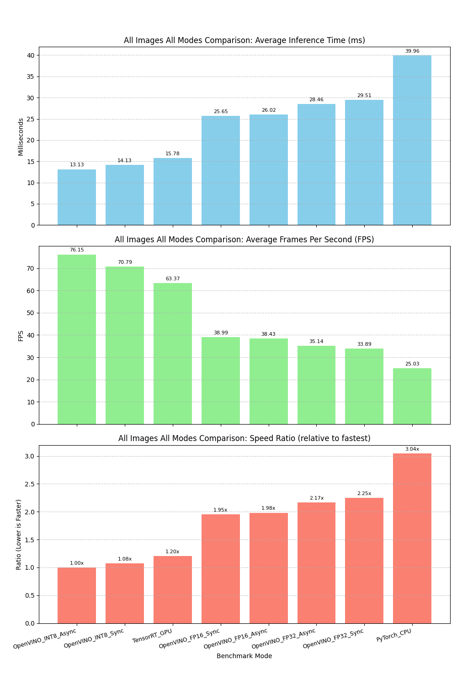
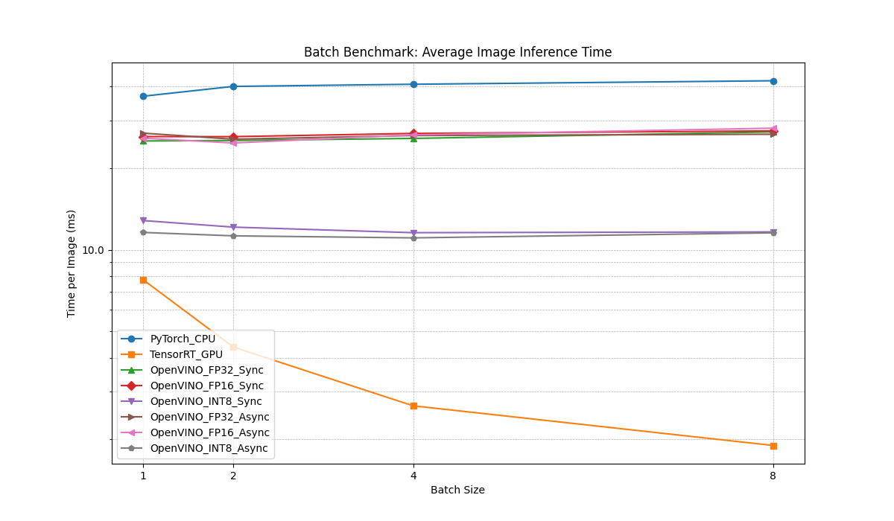
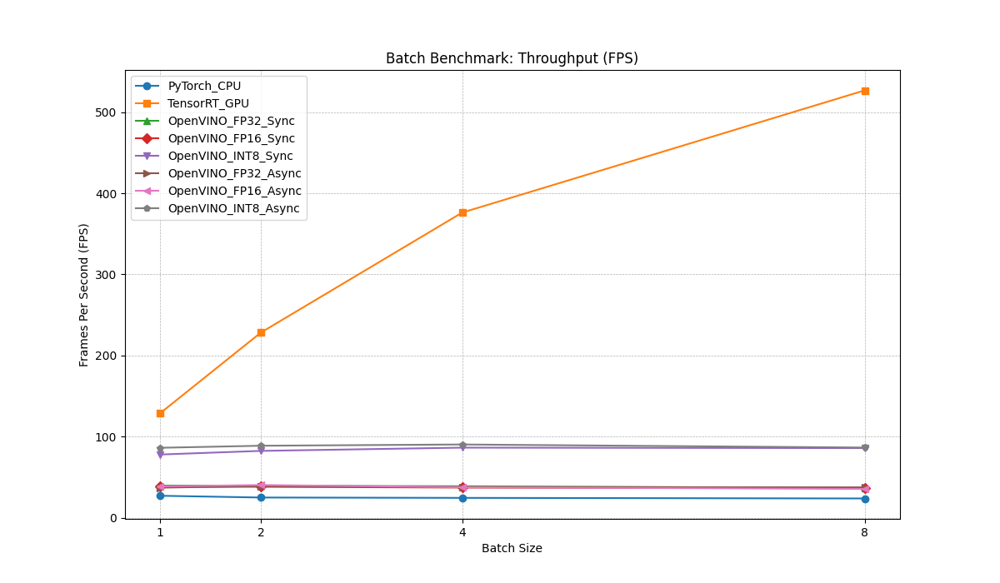

# YOLOv8 Object Detection with Multiple Backends

This project demonstrates how to use YOLOv8 for object detection with multiple inference backends. It supports PyTorch (CPU), OpenVINO (CPU), and TensorRT (GPU) for inference, allowing you to compare performance across different platforms.

## Performance Comparison

Test Environment:
- NVIDIA GeForce RTX 4070 Ti SUPER
- 12th Gen Intel(R) Core(TM) i7-12700KF
- 64GB RAM
- Windows 11 + WSL2 Ubuntu 22.04
- CUDA 11.7
- TensorRT 10.9.0.34
- OpenVINO 2023.3.0

## Quick Start

### Installation

```bash
# Install dependencies
pip install -r requirements.txt

# For conda environment
conda activate py38
pip install -r requirements.txt
```

### Running the Demo

```bash
# Run benchmark comparison across all available backends
python src/simple_demo.py --compare_all --save_summary

# Test random images with all available backends
python src/simple_demo.py --mode all --num_images 3 --results_dir test_results

# Test all images with all available backends
python src/simple_demo.py --test_all --mode all --results_dir test_results_all

# Run specific backend (pytorch_cpu, openvino_cpu, or tensorrt_gpu)
python src/simple_demo.py --mode pytorch_cpu --image test_images/800px-Cat03.jpg
```

### All Images All Modes Comparison

To run this benchmark:

```bash
python src/simple_demo.py --test_all_images_all_modes --model yolov8n.pt --int8_model_dir ./yolov8n_openvino_model_int8 --results_dir test_results --benchmark_runs 10 --benchmark_dir benchmark_results --save_summary
```

*Average performance across all 14 images in `test_images` directory.*
*(Run Date: approx. 2025-04-07 17:01)*



| Mode                | Avg Time (ms) | Avg FPS   | Speed Ratio | Processed |
|-------------------|---------------|-----------|-------------|-----------|
| OpenVINO_INT8_Async |     13.13     |   76.15   |    1.00    x| 14/14     |
| OpenVINO_INT8_Sync  |     14.13     |   70.79   |    1.08    x| 14/14     |
| TensorRT_GPU        |     15.78     |   63.37   |    1.20    x| 14/14     |
| OpenVINO_FP16_Sync  |     25.65     |   38.99   |    1.95    x| 14/14     |
| OpenVINO_FP16_Async |     26.02     |   38.43   |    1.98    x| 14/14     |
| OpenVINO_FP32_Async |     28.46     |   35.14   |    2.17    x| 14/14     |
| OpenVINO_FP32_Sync  |     29.51     |   33.89   |    2.25    x| 14/14     |
| PyTorch_CPU         |     39.96     |   25.03   |    3.04    x| 14/14     |

Key observations from all images test:
1.  **OpenVINO INT8 Async** is now the fastest mode on average across the test images.
2.  **OpenVINO INT8 Sync** follows closely as the second fastest, demonstrating the significant advantage of INT8 on CPU.
3.  **TensorRT GPU** provides the third-best performance.
4.  **OpenVINO FP16 (Sync/Async)** modes are now demonstrably faster than their FP32 counterparts in this test run, although still significantly slower than INT8 or TensorRT.
5.  **Asynchronous execution** shows mixed results: slightly beneficial for INT8 and FP32, but slightly detrimental for FP16 in this average.
6.  **PyTorch CPU** remains the slowest option.

### Batch Processing Performance (All Modes)

To run this benchmark:

```bash
python src/simple_demo.py --run_batch_benchmark --model yolov8n.pt --int8_model_dir ./yolov8n_openvino_model_int8 --benchmark_dir benchmark_results --save_summary --batch_sizes 1 2 4 8 --benchmark_runs 50
```

*Benchmark using a single repeated image (`test_images/800px-Cat03.jpg`) across different batch sizes.*
*(Run Date: approx. 2025-04-07 19:44)*

**Performance Plots:**




**Detailed Metrics:**

**Average Batch Time (ms/batch):**
| Mode                | BS=1    | BS=2    | BS=4    | BS=8    |
|---------------------|---------|---------|---------|---------|
| PyTorch_CPU         | 36.90   | 80.20   | 163.35  | 336.57  |
| TensorRT_GPU        | 7.76    | 8.76    | 10.63   | 15.18   |
| OpenVINO_FP32_Sync  | 25.22   | 50.66   | 103.10  | 217.90  |
| OpenVINO_FP16_Sync  | 26.18   | 52.33   | 107.58  | 219.83  |
| OpenVINO_INT8_Sync  | 12.83   | 24.27   | 46.29   | 93.17   |
| OpenVINO_FP32_Async | 26.96   | 51.21   | 105.66  | 213.65  |
| OpenVINO_FP16_Async | 25.83   | 49.59   | 106.29  | 224.95  |
| OpenVINO_INT8_Async | 11.59   | 22.53   | 44.29   | 92.46   |

**Average Image Time (ms/image):**
| Mode                | BS=1    | BS=2    | BS=4    | BS=8    |
|---------------------|---------|---------|---------|---------|
| PyTorch_CPU         | 36.90   | 40.10   | 40.84   | 42.07   |
| TensorRT_GPU        | 7.76    | 4.38    | 2.66    | 1.90    |
| OpenVINO_FP32_Sync  | 25.22   | 25.33   | 25.77   | 27.24   |
| OpenVINO_FP16_Sync  | 26.18   | 26.16   | 26.89   | 27.48   |
| OpenVINO_INT8_Sync  | 12.83   | 12.13   | 11.57   | 11.65   |
| OpenVINO_FP32_Async | 26.96   | 25.60   | 26.42   | 26.71   |
| OpenVINO_FP16_Async | 25.83   | 24.80   | 26.57   | 28.12   |
| OpenVINO_INT8_Async | 11.59   | 11.26   | 11.07   | 11.56   |

**Throughput (FPS):**
| Mode                | BS=1    | BS=2    | BS=4    | BS=8    |
|---------------------|---------|---------|---------|---------|
| PyTorch_CPU         | 27.10   | 24.94   | 24.49   | 23.77   |
| TensorRT_GPU        | 128.94  | 228.28  | 376.19  | 526.87  |
| OpenVINO_FP32_Sync  | 39.65   | 39.48   | 38.80   | 36.71   |
| OpenVINO_FP16_Sync  | 38.20   | 38.22   | 37.18   | 36.39   |
| OpenVINO_INT8_Sync  | 77.95   | 82.42   | 86.42   | 85.86   |
| OpenVINO_FP32_Async | 37.10   | 39.06   | 37.86   | 37.44   |
| OpenVINO_FP16_Async | 38.72   | 40.33   | 37.63   | 35.56   |
| OpenVINO_INT8_Async | 86.25   | 88.77   | 90.31   | 86.53   |

Key observations from batch benchmark:
1.  **TensorRT GPU** remains the king of throughput, demonstrating excellent scaling with increasing batch size.
2.  **OpenVINO INT8 Async** consistently delivers the best performance on the CPU across all tested batch sizes. INT8 Sync is a close second.
3.  **Asynchronous execution (Async)** provides a small throughput advantage over Synchronous (Sync) for OpenVINO INT8, FP16, and FP32 on CPU in most cases, particularly noticeable at smaller batch sizes.
4.  **OpenVINO FP16 vs FP32 on CPU:** FP16 shows a clear advantage at Batch Size 1. However, at larger batch sizes (BS=2, 4, 8) in this test, FP32 performed slightly better or comparably to FP16.
5.  **CPU Batch Scaling:** Unlike the GPU, OpenVINO on CPU (FP32/FP16) shows limited throughput gains from batching beyond BS=2. INT8 shows some moderate scaling up to BS=4.
6.  **PyTorch CPU** is the slowest option and does not benefit from batch processing.

## Docker Usage

This project can also be run inside a Docker container, which includes all necessary dependencies and configurations.

### Prerequisites

-   [Docker](https://docs.docker.com/get-docker/) installed on your system.
-   [NVIDIA Container Toolkit](https://docs.nvidia.com/datacenter/cloud-native/container-toolkit/install-guide.html) installed to enable GPU access within Docker containers (required for TensorRT GPU mode).

### Building the Docker Image

Ensure you have the `Dockerfile` and an up-to-date `requirements.txt` in the project root. Then, build the image using:

```bash
docker build -t yolo-openvino-demo:latest .
```

*Note: The initial build might take a while as it downloads the base image and installs dependencies.*

### Running the Container

To run commands inside the container, use `docker run`. Here are some common examples:

**1. Running the Help Command (Default):**

```bash
docker run --rm yolo-openvino-demo:latest
```
*   `--rm`: Automatically remove the container when it exits.

**2. Running TensorRT GPU Mode (Requires NVIDIA Container Toolkit):**

You need to mount the model directory and potentially results/benchmark directories from your host machine into the container.

```bash
# Make sure your current directory is the project root on the host
docker run --rm --gpus all \\
    -v $(pwd)/models:/app/models \\
    -v $(pwd)/test_images:/app/test_images \\
    -v $(pwd)/yolov8n_openvino_model_int8:/app/yolov8n_openvino_model_int8 \\
    -v $(pwd)/test_results:/app/test_results \\
    -v $(pwd)/benchmark_results:/app/benchmark_results \\
    yolo-openvino-demo:latest \\
    python3 src/simple_demo.py --mode tensorrt_gpu --image test_images/800px-Cat03.jpg --output test_results/docker_trt_output.jpg
```
*   `--gpus all`: Grants the container access to all available GPUs.
*   `-v $(pwd)/local_dir:/app/container_dir`: Mounts a directory from your host (`local_dir`) to a path inside the container (`container_dir`). We mount:
    *   `models`: Contains the base `.pt` model.
    *   `test_images`: Input images.
    *   `yolov8n_openvino_model_int8`: INT8 model (adjust path if needed).
    *   `test_results`: To save output images.
    *   `benchmark_results`: To save benchmark plots/summaries.
*   The command after the image name (`yolo-openvino-demo:latest`) overrides the default CMD and runs the TensorRT test.

**3. Running OpenVINO INT8 Mode:**

GPU access is not needed for OpenVINO CPU modes.

```bash
docker run --rm \\
    -v $(pwd)/models:/app/models \\
    -v $(pwd)/test_images:/app/test_images \\
    -v $(pwd)/yolov8n_openvino_model_int8:/app/yolov8n_openvino_model_int8 \\
    -v $(pwd)/test_results:/app/test_results \\
    -v $(pwd)/benchmark_results:/app/benchmark_results \\
    yolo-openvino-demo:latest \\
    python3 src/simple_demo.py --mode openvino_cpu --precision INT8 --int8_model_dir ./yolov8n_openvino_model_int8 --image test_images/800px-Cat03.jpg --output test_results/docker_ov_int8_output.jpg
```

**4. Running Batch Benchmark:**

```bash
docker run --rm --gpus all \\
    -v $(pwd)/models:/app/models \\
    -v $(pwd)/test_images:/app/test_images \\
    -v $(pwd)/yolov8n_openvino_model_int8:/app/yolov8n_openvino_model_int8 \\
    -v $(pwd)/benchmark_results:/app/benchmark_results \\
    yolo-openvino-demo:latest \\
    python3 src/simple_demo.py --run_batch_benchmark --model yolov8n.pt --int8_model_dir ./yolov8n_openvino_model_int8 --benchmark_dir benchmark_results --save_summary --batch_sizes 1 2 4 8
```

**Explanation of Volume Mounts (`-v`):**

Since the Docker image doesn't include the model files or output directories (as defined in `.dockerignore`), we use volume mounts to link directories from your host machine to directories inside the container. This allows the script running inside the container to access your models and save results back to your host machine. Adjust the host paths (`$(pwd)/...`) if your project structure differs or if models are stored elsewhere.

## Features

- Support for multiple inference backends (PyTorch CPU, OpenVINO CPU, TensorRT GPU)
- Automatic model conversion between formats
- Comprehensive performance benchmarking
- Batch processing of random or all images in a directory
- Performance comparison visualization
- Detection results saved with bounding boxes and labels


### Command Options

```
--image           : Input image path (default: test_images/800px-Cat03.jpg)
--model           : Model path (default: yolov8n.pt)
--threshold       : Detection confidence threshold (default: 0.25)
--output          : Output directory for saving results (default: output)
--mode            : Run mode: pytorch_cpu, openvino_cpu, tensorrt_gpu, or all
--benchmark       : Run multiple inferences to benchmark performance
--benchmark_runs  : Number of inference runs for benchmarking (default: 10)
--compare_all     : Compare all available backends
--save_summary    : Save summary to a text file
--num_images      : Number of random images to test (default: 5)
--test_all        : Test all images in test_images directory
--results_dir     : Directory for detection results (default: test_results)
--benchmark_dir   : Directory for benchmark results (default: benchmark_results)
```

## Project Structure

```
yolo-openvino-demo/
├── benchmark_results/     # Benchmark results and charts
├── models/                # Model storage directory
│   └── yolov8n_openvino_model/  # OpenVINO IR model
├── src/                   # Source code
│   ├── download_model.py  # Model download script
│   └── simple_demo.py     # Main demo script with all functionality
├── test_images/           # Test images
├── test_results/          # Detection results by backend
│   ├── pytorch_cpu/       # PyTorch CPU detection results
│   ├── openvino_cpu/      # OpenVINO CPU detection results
│   └── tensorrt_gpu/      # TensorRT GPU detection results
├── install.sh             # Installation script
└── requirements.txt       # Dependency list
```

## Troubleshooting

If you encounter issues:

1. Ensure all dependencies are installed (`pip install -r requirements.txt`)
2. For TensorRT issues:
   - Check that CUDA and TensorRT are properly installed
   - If TensorRT model conversion fails, try using the `--skip_convert` option
3. For OpenVINO issues:
    - Ensure OpenVINO is correctly installed and configured
    - Try setting environment variable `export OPENVINO_FORCE_CPU=1`
4. For PyTorch issues:
    - Check PyTorch installation with correct CUDA version

### OpenVINO FP16 & INT8 Quantization Notes & Tips

**Important**: Using `--precision FP16` or `--precision INT8` with OpenVINO requires the corresponding model to be **pre-converted** to that precision *before* running the inference script. The script **will not** perform the conversion automatically during inference.
- For **FP16**, you can use the `download_model.py` script (which uses `half=True` during export) or manually run `mo --input_model <input_model> --data_type FP16 ...`.
- For **INT8**, you need to use a quantization tool like NNCF (see below).

Quantizing models to INT8 with OpenVINO can significantly boost CPU performance but might require extra steps and troubleshooting:

1.  **Quantization is Offline**: INT8 inference requires a model pre-quantized using tools like OpenVINO NNCF. It's not an on-the-fly conversion during inference.
2.  **POT Tool (Deprecated)**:
    *   The Post-Training Optimization Tool (POT) is officially deprecated, and NNCF is recommended.
    *   If using POT:
        *   Requires `openvino-dev` installation (`pip install openvino-dev`).
        *   The `pot` command might not be in PATH. Find its full path (e.g., `~/miniconda3/envs/YOUR_ENV/bin/pot`) and use that.
        *   Ensure the FP32 OpenVINO model (`.xml`/`.bin`) exists *before* running POT and the path in the POT config (`.yml`) is correct.
        *   May encounter errors with telemetry, parameters (`--output-dir` vs `-o`), or specific model operations (like `Concat` shape inference). Re-exporting the FP32 model or trying different POT presets (`mixed` vs `performance`) might help, but switching to NNCF is often more reliable.
3.  **NNCF (Recommended)**:
    *   Install via `pip install nncf`. It also requires `torch` and `torchvision`.
    *   Requires a Python script (like `quantize_nncf.py` in this project) to perform quantization, not just a config file.
    *   Needs a representative **calibration dataset** (images from `test_images` can work).
    *   NNCF API might change between versions. We encountered:
        *   `AttributeError: module 'nncf' has no attribute 'Preset'`: Solution was to remove the `preset` argument from `nncf.quantize()` and use defaults.
        *   `TypeError: object of type 'Dataset' has no len()`: Solution was to calculate the number of calibration samples *before* creating the `nncf.Dataset` object and pass that count to `subset_size`.
4.  **Asynchronous Callback Signature**: OpenVINO's `AsyncInferQueue.set_callback()` API might expect different arguments depending on the version. We encountered errors because the callback was passed extra arguments. Solution was to define the callback to accept extra arguments using `*args`: `

## OpenVINO Post-processing Usage Notes & Backend Details

*   **OpenVINO Post-processing**: **Initially, the only way to process the raw output of the OpenVINO model (e.g., an array with shape `[1, 84, 8400]`) and perform Non-Maximum Suppression (NMS) was to rely on the functionality of the PyTorch/Ultralytics library.** This meant that even when using OpenVINO for inference, the PyTorch environment **had to** be installed and used to complete the post-processing. To remove this dependency, we later introduced the `process_openvino_output` function, which **directly uses OpenCV (`cv2.dnn.NMSBoxes`) and NumPy** to decode the model output, scale coordinates, and perform NMS. This makes the OpenVINO inference and post-processing flow completely independent of PyTorch/Ultralytics.
*   **Model Paths**: Please ensure your model paths (`--model`, `--int8_model_dir`) are correct, especially when running different modes or inside Docker.
*   **TensorRT Warm-up**: When using TensorRT, the first inference run might take longer due to engine building and optimization. Subsequent runs will be faster.